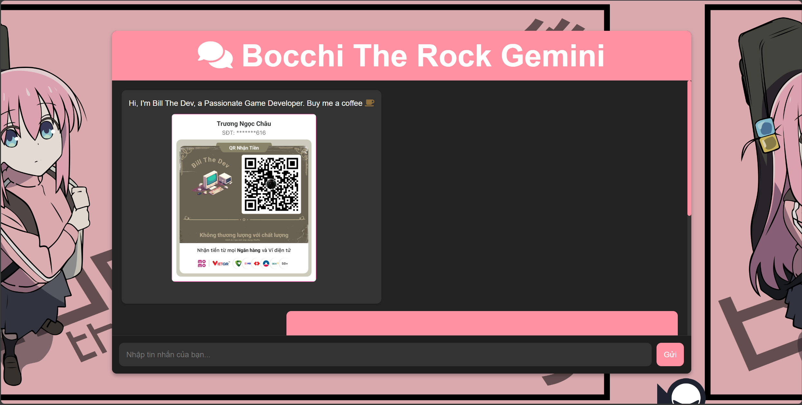

# Bill Gemini Chat Application



## Introduction

Bill Gemini is a chat application developed by Bill The Dev, a passionate programmer with a love for games and web technologies. This project leverages the Gemini API and aims to expand knowledge in web APIs and the integration of modern technologies like Markdown and FontAwesome icons.

## Key Features

- **Text Messaging**: Supports sending and receiving messages between users and bots.
- **Markdown Support**: Integrated Markdown processing to display rich content, including links, images, and code snippets.
- **File Upload and Audio Recording**: Allows users to upload image and video files, and record audio directly from the browser.
- **API Integration**: Uses Gemini API to create and manage chat content efficiently.

## Installation and Usage

### Requirements

- A browser supporting HTML5 and JavaScript.
- An internet connection to use the API and load libraries.

### Installation Guide

1. Clone the repository to your local machine:
    ```bash
    git clone https://github.com/username/bill-gemini-chat.git
    ```

2. Open the `index.html` file in your preferred browser:
    ```plaintext
    open index.html
    ```

3. Configure the API if necessary by editing the API paths in the `scripts.js` file.

### Usage Instructions

1. Enter your message in the input field and press "Send" to send the message.
2. Use the file upload feature to upload images, videos, or audio recordings.
3. Enhance your message content with icons and markdown for a richer experience.

## Project Structure
```plaintext
Bill Gemini Chat Application/
│
├── hitori.png # Background image for the application
├── momo.jpg # Momo icon for decoration
├── styles.css # CSS file for styling
├── scripts.js # JavaScript file for handling logic
├── README.md # Usage guide
└── index.html # Main application page
```

## Technologies Used

- **HTML5**: Structure and display content on the web page.
- **CSS3**: Style and format the user interface.
- **JavaScript**: Add functionality and logic to the application.
- **Marked.js**: Library for processing Markdown.
- **FontAwesome**: Use icons from FontAwesome to enhance the UI.

## Contact

- **YouTube**: [Bill The Dev's YouTube Channel](https://www.youtube.com/channel/UCdRe_4FG7JhOERlfcyeNhnw)
- **Facebook**: [Bill The Dev's Facebook Page](https://www.facebook.com/billthedev)
- **GitHub**: [Bill The Dev's GitHub Repository](https://github.com/billthedev)
- **LinkedIn**: [Bill The Dev's LinkedIn Profile](https://www.linkedin.com/in/billthedev)
- **Skype**: [Contact via Skype](https://www.skype.com/billthedev)

Thank you for using Bill Gemini Chat Bot! Enjoy and share with your friends!

<p align="center" style="font-size: 2em; font-weight: bold; color: #FFA500; text-shadow: 2px 2px 4px #000, 4px 2px 2px #AAAAAA; border: 3px solid #444; background-color: #111">
  Bill The Dev
</p>

<p align="center">
  
</p>
