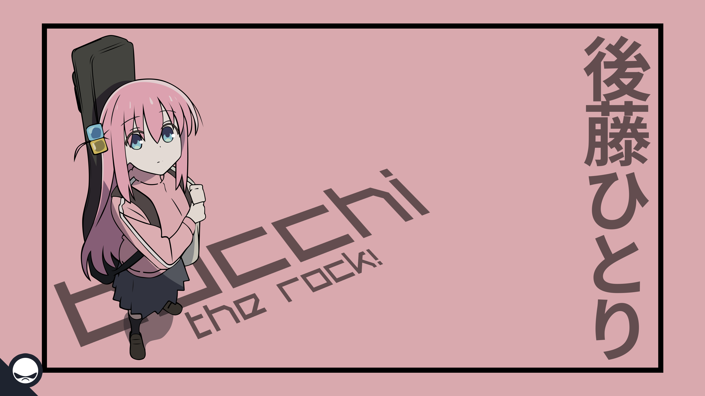

# Bill Gemini Chat Application


## Giới thiệu

Bill Gemini là một ứng dụng chat được phát triển bởi Bill The Dev, một lập trình viên đam mê game và công nghệ web. Dự án này sử dụng Gemini API và được phát triển với mục tiêu mở rộng kiến thức về web APIs và tích hợp các công nghệ hiện đại như Markdown và các biểu tượng từ FontAwesome.

## Chức năng chính

- **Gửi tin nhắn văn bản**: Hỗ trợ gửi và nhận tin nhắn giữa người dùng và bot.
- **Markdown**: Tích hợp khả năng xử lý Markdown để hiển thị nội dung phong phú, bao gồm liên kết, hình ảnh, và mã code.
- **Upload tệp và ghi âm**: Cho phép người dùng tải lên các tệp hình ảnh, video, và ghi âm trực tiếp từ trình duyệt.
- **Tích hợp API**: Sử dụng Gemini API để tạo và quản lý nội dung trò chuyện một cách hiệu quả.

## Cách cài đặt và sử dụng

### Yêu cầu

- Trình duyệt hỗ trợ HTML5 và JavaScript.
- Kết nối Internet để sử dụng API và tải các thư viện.

### Hướng dẫn cài đặt

1. Clone repository về máy của bạn:
    ```bash
    git clone https://github.com/username/bill-gemini-chat.git
    ```

2. Mở file `index.html` trong trình duyệt yêu thích của bạn:
    ```plaintext
    open index.html
    ```

3. Thực hiện cấu hình API nếu cần thiết bằng cách chỉnh sửa các đường dẫn API trong file `scripts.js`.

### Cách sử dụng

1. Nhập tin nhắn vào ô nhập liệu và nhấn "Gửi" để gửi tin nhắn.
2. Sử dụng các tính năng upload tệp để tải lên hình ảnh, video, hoặc ghi âm.
3. Sử dụng các biểu tượng và markdown để làm phong phú thêm nội dung tin nhắn của bạn.

## Cấu trúc dự án

Bill Gemini Chat Application/
│
├── hitori.png           # Hình nền của ứng dụng
├── momo.jpg             # Biểu tượng Momo để trang trí
├── styles.css           # File CSS cho giao diện
├── scripts.js           # File JavaScript xử lý logic
├── README.md            # File hướng dẫn sử dụng
└── index.html           # Trang chính của ứng dụng


## Các công nghệ sử dụng

- **HTML5**: Cấu trúc trang web và hiển thị nội dung.
- **CSS3**: Tạo kiểu và định dạng cho giao diện người dùng.
- **JavaScript**: Thêm tính năng và logic cho ứng dụng.
- **Marked.js**: Thư viện xử lý Markdown.
- **FontAwesome**: Sử dụng biểu tượng từ FontAwesome để trang trí giao diện.

## Liên hệ

- **YouTube**: [Kênh YouTube của Bill The Dev](https://www.youtube.com/channel/UCdRe_4FG7JhOERlfcyeNhnw)
- **Facebook**: [Trang Facebook của Bill The Dev](https://www.facebook.com/billthedev)
- **GitHub**: [Kho GitHub của Bill The Dev](https://github.com/billthedev)
- **LinkedIn**: [Hồ sơ LinkedIn của Bill The Dev](https://www.linkedin.com/in/billthedev)
- **Skype**: [Liên hệ qua Skype](https://www.skype.com/billthedev)

Cảm ơn bạn đã sử dụng Bocchi The Rock Gemini Chat Bot! Hãy thưởng thức và chia sẻ với bạn bè!

<p style="text-align: center; font-size: 2em; font-weight: bold; color: #FFA500; text-shadow: 2px 2px 4px #555555, 4px 4px 8px #AAAAAA;">
  Bill The Dev
</p>

<p style="text-align: center;">
  
</p>
